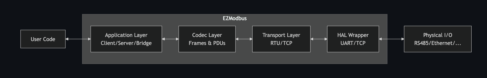

# Library overview

## Basic flow



Once initialized, the library handles all the low-level details:

* TX/RX tasks manage communication timing and framing
* Callbacks inform your application when data arrives
* No polling required - everything runs in background tasks

## Features

* **Dual-Mode Transport**
    * **Modbus RTU** over RS-485 via UART, optional DE/RE control
    * **Modbus TCP** over WiFi/Ethernet/netif (ESP32), Ethernet (Pico + CH9120)
* **Flexible Application Layer**
    * **Client**: synchronous/blocking or asynchronous reads/writes with result trackers or callbacks
    * **Server**: direct‐pointer or callback register access, automatic validation and exception handling
    * **Bridge**: link any two interfaces (RTU↔︎TCP, RTU↔︎RTU, TCP↔︎TCP) for transparent proxying
* **Standards Compliance**
    * 3.5-character silent intervals for RTU, broadcast rules, exception code semantics
    * Full coverage of all common Modbus Function Codes (0x01–0x10)
* **Memory Approach**
    * Zero dynamic allocation by default
    * Dynamic allocations optional: Server can use stack or controlled (no reallocations at runtime) heap storage for Modbus registers.
* **Examples & Unity test suite**
    * Native tests for codec
    * Hardware loopback tests for interface & application layers

## Namespaces & components

```cpp
// Core & application components
namespace Modbus {
    class Client;                   // Master device implementation
    class Server;                   // Slave device implementation  
    class Bridge;                   // Interface bridge/proxy
    
    struct Frame;                   // Modbus message abstraction
    struct FrameMeta;               // Frame metadata (internal)
    struct Word;                    // Register abstraction (Server)
    
    class IWordStore;               // Abstract register storage
    class StaticWordStore<N>;       // Stack-based register storage
    class DynamicWordStore;         // Heap-based register storage
    
    enum RegisterType;              // COIL, DISCRETE_INPUT, HOLDING_REGISTER...
    enum FunctionCode;              // READ_COILS, WRITE_REGISTER...
    enum ExceptionCode;             // ILLEGAL_FUNCTION, SLAVE_DEVICE_BUSY...
    enum Role;                      // CLIENT/MASTER, SERVER/SLAVE
    
    namespace Debug { /* ... */ }   // Debug logging utilities
    class Logger;                   // Safe log sink
}

// Frame encoding/decoding
namespace ModbusCodec {
    namespace RTU { /* ... */ }     // RTU frame codec
    namespace TCP { /* ... */ }     // TCP frame codec
}

// Transport layer management
namespace ModbusInterface {
    class IInterface;               // Abstract transport interface
    class RTU;                      // Modbus RTU over UART/RS485
    class TCP;                      // Modbus TCP over sockets
}

// Hardware abstraction layer
namespace ModbusHAL {
    class UART;                     // UART/RS485 driver
    class TCP;                      // TCP socket driver
}

// FreeRTOS utilities & types
class Mutex;                    // RAII mutex wrapper
class Lock;                     // RAII lock guard
class ByteBuffer;               // Vector-like binary data handler
```