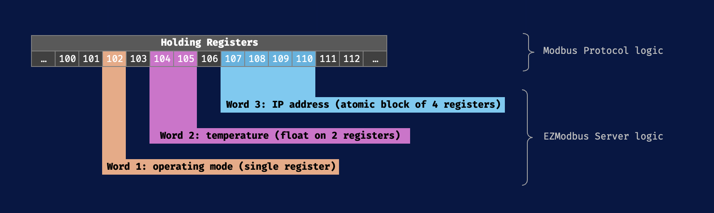

# Modbus::Word

The `Modbus::Word` structure defines how your server exposes and manages **atomic blocks of registers** for Modbus clients to access.&#x20;

A `Word` can be either :

* A single Modbus coil/register mapped directly to your data
* Or a span of Modbus coils/registers that will be converted to/from C++ variables by your application (e.g. `float` encoded in IEEE 754 format)

The following figure shows an example use case for different Words mapped to different sets of Modbus registers:


*Example of mapping between Modbus registers <> Words*

!!! note
    The main advantage of handling Words in the server, is to enhance the capability of Modbus's limited 16-bit registers for exposing "complex" data, while guaranteeing data integrity by avoiding partial read/writes of registers inside a Word which could imply undefined behaviour.

The `Word` type encapsulate all metadata & access methods for a Word:

```cpp
struct Word {
    Modbus::RegisterType type; // Underlying type: COIL, DISCRETE_INPUT, etc.
    uint16_t startAddr;        // Modbus start address of this block
    uint16_t nbRegs;           // Number of contiguous 16-bit registers in this block

    // 1. Direct pointer for single-register Words (nbRegs == 1)
    volatile uint16_t* value;        // Direct, zero-overhead access

    // 2. Handlers for atomic read/write operations
    ReadWordHandler   readHandler;   // Called for any READ request on this block
    WriteWordHandler  writeHandler;  // Called for any WRITE request on this block
    void* userCtx;                   // Passed to the handlers when called (optional)
};
```

!!! note
    Out of simplicity, all Modbus register types use `uint16_t` as base type.

    * For a coil or discrete input, a non-null read `value` is interpreted as `true`
    * The server will explicitly set `value`  to `1`if requested to write a `true` state.

To setup a Modbus Server, you will have to define a list of Words managed by the server and register them. The `Word` structure principles make EZModbus's server implementation secure and flexible:

1. **Single vs multi-register**:
    * **Single register** (`nbRegs == 1`): use either ptr to `value` (direct access) **or** handlers
    * **Multi-register** (`nbRegs > 1`): **must** use handlers for thread-safety and atomicity
2. **Data integrity**: Either the entire Word is read/written, or the operation fails cleanly with the server returning an `ILLEGAL_DATA_ADDRESS` exception : avoids partial operations leading to data corruption
3. **Dynamic Modbus exceptions**: you can handle read/write failures by returning a `Modbus::ExceptionCode` in handlers (`NULL_EXCEPTION` = success, others = error forwarded to the client)
4. **Overlap protection**: adding a Word that overlaps existing Words will be rejected

By default, the server limits the maximum number of registers in each word is capped to 8 (`MAX_WORD_SIZE` constant).

More information about the different possibilities to expose & handle Words are provided in the [How-To Guides > Modbus Server (Slave)](../30-how-to-guides/301-modbus-server-slave.md#word-value-access-methods) section of this guide.
